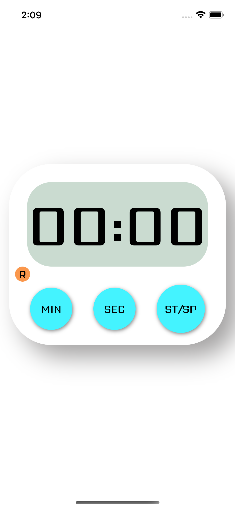

# 🕒 React Native Timer App

A simple and elegant **Timer App** built using **React Native** and **Expo**. This app allows users to start, pause, and reset a timer — perfect for workouts, study sessions, or productivity boosts.

## 📱 Features

- ⏱️ Start / Stop / Reset Timer
- 🔔 Alert on Completion *(TODO)*
- 🎨 Clean and responsive UI
- 📱 Cross-platform: Works on both Android and iOS via Expo

## 🖼️ Screenshots

<p float="left">
  
  
</p>


## 🚀 Getting Started

These instructions will help you run the app on your local machine using Expo.

### Prerequisites

- Node.js & npm
- Expo CLI (`npm install -g expo-cli`)
- Git

### Installation

1. **Clone the repository**
   ```bash
   git clone https://github.com/your-username/timer-app.git
   cd timer-app
